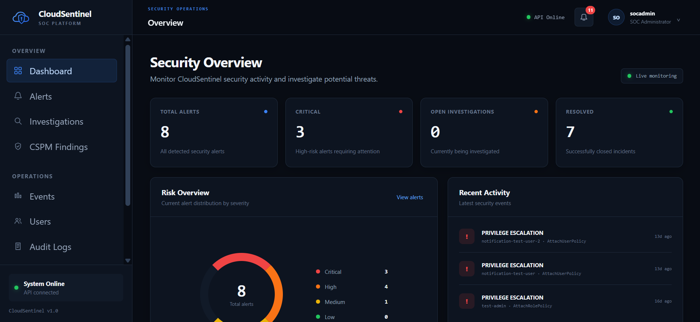
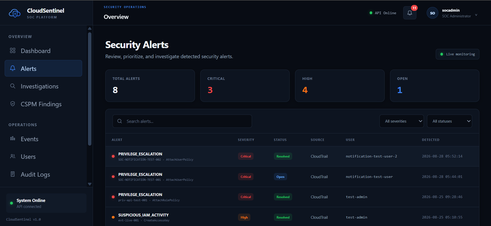
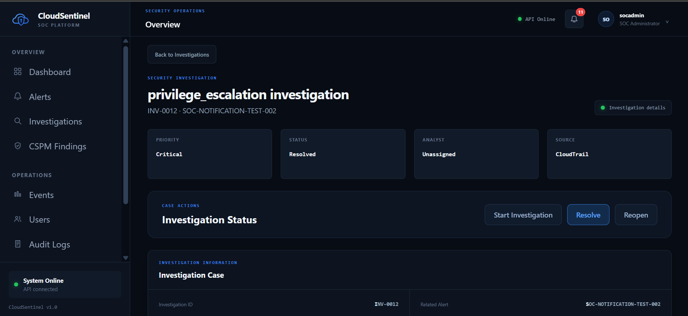
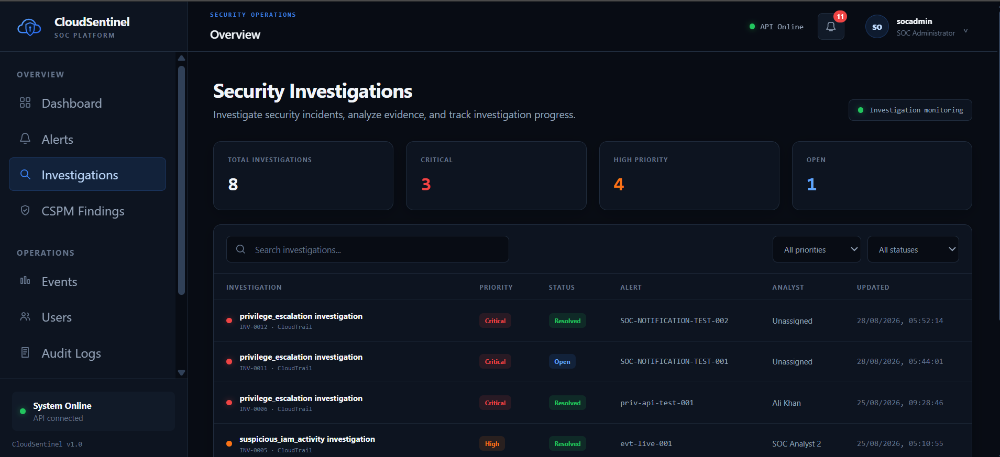
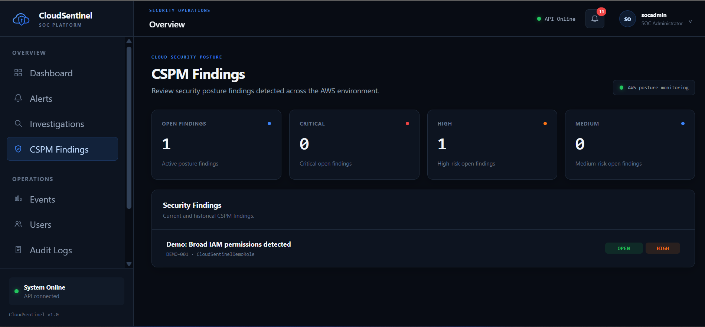
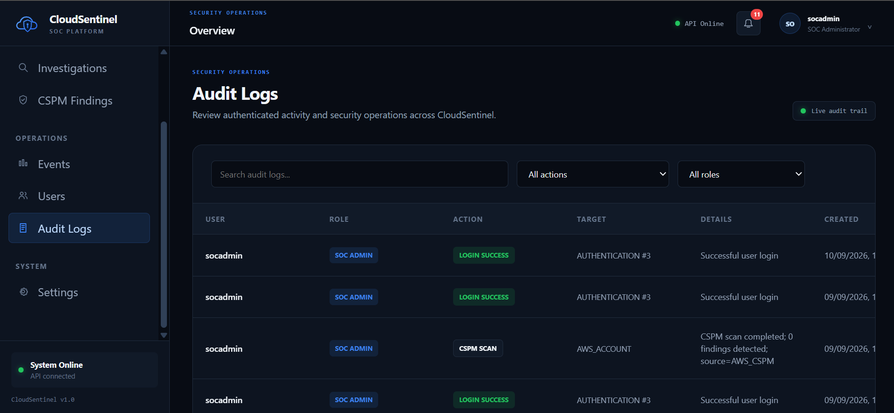

# CloudSentinel

### Cloud Security Operations Platform

> **Turning cloud telemetry into security signals, investigations, and actionable security operations.**

CloudSentinel is a security operations platform designed to monitor AWS activity, detect suspicious behavior, prioritize security alerts, support analyst investigations, assess cloud security posture, and maintain an auditable security workflow.

It brings together **cloud monitoring, detection engineering, risk scoring, incident investigation, CSPM, notifications, authentication, RBAC, and auditability** in a single SOC-oriented platform.

---

## 🚨 The Problem

Modern cloud environments generate enormous amounts of security telemetry.

The challenge is not simply collecting events.

The real challenge is turning those events into:

**Signal → Context → Risk → Investigation → Resolution → Accountability**

CloudSentinel was built around that workflow.

Instead of treating security events as isolated logs, CloudSentinel transforms cloud activity into a structured security operations process.

---

# 🛡️ What CloudSentinel Does

CloudSentinel currently provides a complete security workflow across several layers:

| Capability | Description |
|---|---|
| ☁️ AWS CloudTrail Monitoring | Collects and processes AWS API activity |
| 🔍 Event Normalization | Converts raw cloud events into a consistent security-event model |
| 🧠 Detection Engine | Identifies suspicious IAM, authentication, privilege escalation, and source-IP activity |
| 🎯 Risk Scoring | Assigns risk scores and severity levels to detected activity |
| 🚨 Alert Management | Centralizes and prioritizes security alerts |
| 🔎 Investigation Workflow | Allows analysts to investigate, assign, track, resolve, and reopen incidents |
| 🔔 Notifications | Generates notifications for high-severity security activity |
| 🛡️ CSPM | Identifies cloud security posture findings |
| 👥 Authentication & RBAC | Controls access based on SOC roles |
| 📋 Audit Trail | Records security operations and administrative activity |
| ⚙️ Continuous AWS Worker | Continuously polls and processes AWS CloudTrail activity |
| 🪟 Windows Deployment | Standalone worker packaging and Windows service deployment architecture |

---

## Product Preview

CloudSentinel provides a unified security operations workflow for monitoring
cloud activity, detecting suspicious behavior, investigating alerts, and
maintaining security accountability.

### SOC Dashboard

<p align="center">
  
</p>

### Security Alerts

<p align="center">
  
</p>

### Alert Investigation

<p align="center">
  
</p>

### Investigation Management

<p align="center">
  
</p>

### Cloud Security Posture Management

<p align="center">
  
</p>

### Audit Trail

<p align="center">
  
</p>

## 🧩 Security Operations Workflow

CloudSentinel follows a security-operations workflow rather than simply displaying raw cloud logs.

```text
                         AWS ENVIRONMENT
                               │
                               ▼
                    ┌─────────────────────┐
                    │    AWS CloudTrail   │
                    └──────────┬──────────┘
                               │
                               ▼
                    ┌─────────────────────┐
                    │ Event Normalization │
                    └──────────┬──────────┘
                               │
                               ▼
                    ┌─────────────────────┐
                    │   Detection Engine  │
                    └──────────┬──────────┘
                               │
                               ▼
                    ┌─────────────────────┐
                    │    Risk Scoring     │
                    └──────────┬──────────┘
                               │
                               ▼
                    ┌─────────────────────┐
                    │    Alert Store      │
                    └──────────┬──────────┘
                               │
                 ┌─────────────┼─────────────┐
                 │             │             │
                 ▼             ▼             ▼
            Dashboard    Notifications  Investigations
                                             │
                                             ▼
                                      Analyst Workflow
                                             │
                                             ▼
                                     Resolution / Reopen
                                             │
                                             ▼
                                        Audit Trail